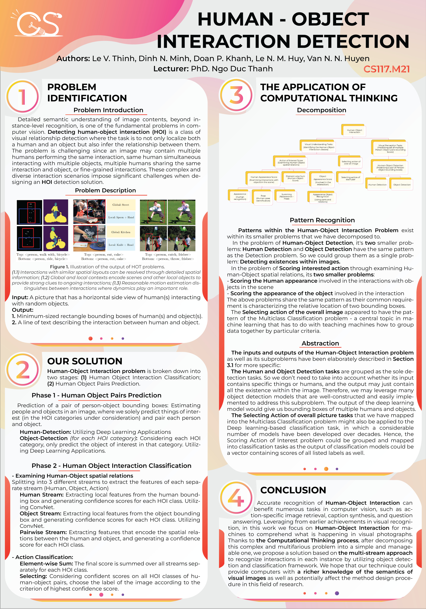

<!-- Banner -->

  

<h1 align="center"><b>COMPUTATIONAL THINKING</b></h>

## THÀNH VIÊN NHÓM

| STT    | MSSV          | Họ và Tên              | Github                                               | Email                   |
| ------ |:-------------:| ----------------------:|-----------------------------------------------------:|-------------------------:
| 1      | 20520781      | Lê Việt Thịnh          |     https://github.com/levietthinh                                           |20520781@gm.uit.edu.vn   |
| 2      | 20521597      | Đinh Nhật Minh         |https://github.com/Banhkun	                        |20521597@gm.uit.edu.vn   |
| 3      | 20521443      | Đoàn Phương Khanh ||20521443@gm.uit.edu.vn   |
| 4      | 20521394     | Lê Nguyễn Minh Huy ||20521394@gm.uit.edu.vn   |
| 5      | 20521424      | Văn Nguyễn Ngọc Huyền |https://github.com/ngochuynnuit |20521424@gm.uit.edu.vn   |

## GIỚI THIỆU MÔN HỌC

-   **Tên môn học:** Computational Thinking (Tư duy tính toán)
-   **Mã môn học:** CS117
-   **Mã lớp:** CS117.M21
-   **Năm học:** HK2 (2021 - 2022)
-   **Giảng viên**: TS.Ngô Đức Thành

## ĐỒ ÁN CUỐI KÌ

-   **Tên đề tài**: Human Object Interaction Detection
-   **Giới thiệu**
    -   Phát hiện tương tác giữa người và vật thể (HOI) ra đời hỗ trợ nhận diện nội dung về mặt ngữ nghĩa của hình ảnh.
    -   Nhiệm vụ chính của bài toán: Xác định mối tương quan về mặt thị giác trong hình ảnh, tức không chỉ phát hiện vị trí của cả người và vật thể trong hình mà còn suy ra các tương tác giữa chúng (ví dụ “người lái xe hơi”).
    -   Đồ án này vận dụng các kỹ thuật từ môn học Tư duy tính toán (Decomposition, Pattern Recognition, Abstraction) nhằm nhận diện, phân tích và khảo sát hướng giải quyết cho bài toán HOI Detection nêu trên
    </h3>
    
